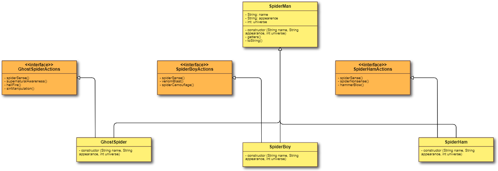

# Backend Java
## Practica Harry
### Captura funcionando

### Diagrama de clases

## Practica Mona
### Captura funcionando

### Diagrama de clases

## Practica Multiverso
### Captura funcionando

### Diagrama de clases

